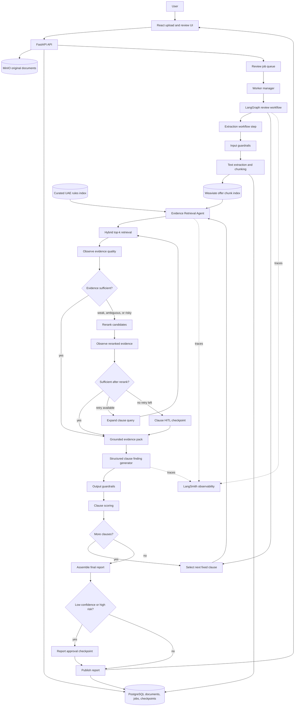

# Architecture foundations

## Product intent

OfferGuard is an AI-assisted UAE offer-letter review system. A user uploads an
offer letter, the system extracts and chunks the document, compares the evidence
against a curated UAE employment rule base, and returns a fixed-clause report
with citations, scores, risk categories, and human-review checkpoints.

This product provides review support and learning value. It is not legal advice.
Every report must include a clear informational-use disclaimer and evidence
citations.

## Agentic boundary

Not every LLM workflow is an agentic system. OfferGuard should use agentic
behavior only where the system must dynamically choose the next action from
incomplete evidence.

The stable workflow is:

```text
upload -> store original -> extract -> chunk -> embed/store -> clause loop -> final report
```

The agentic part is the per-clause evidence loop:

```text
retrieve -> observe evidence -> decide next action -> act -> repeat or stop
```

The core agent is therefore the **Evidence Retrieval Agent**. Its goal for each
fixed clause is:

```text
Find enough trustworthy offer evidence and UAE rule evidence to score this
clause, or escalate safely to human review.
```

The report generator is not the primary agent. It is a structured generation
step that receives curated evidence packs and produces grounded clause findings.

## Runtime topology

```text
Browser -> frontend (Nginx + React) -> backend (FastAPI)
                                         |-> PostgreSQL: metadata, jobs, checkpoints, HITL
                                         |-> MinIO: original uploaded files
                                         |-> Weaviate: hybrid retrieval indexes and citation metadata
                                         `-> model and tracing providers
```

The application code remains a modular monolith because one FastAPI deployment
is currently the right operational unit. Stateful infrastructure runs as
separate services because each store has a distinct protocol, lifecycle, health
model, and backup strategy.

## Storage ownership

- **PostgreSQL** is the system of record for documents, review jobs, workflow
  checkpoints, clause results, HITL decisions, and feedback.
- **MinIO** stores document bytes. PostgreSQL records the bucket, object key,
  checksum, media type, size, and upload status.
- **Weaviate** stores replaceable vector projections, hybrid retrieval indexes,
  and retrieval metadata.
  PostgreSQL and MinIO remain authoritative if an index must be rebuilt.

## Backend dependency direction

```text
API routes -> application services -> domain rules
                         |
                         +-> LangGraph workflows -> agents/tools
                         +-> persistence, object storage, and RAG adapters
                         +-> guardrail policies

All layers -> observability ports/adapters
```

`backend/src/app` deliberately uses a neutral package name. Routers handle HTTP,
services coordinate use cases, workflows own state transitions, agents own
goal-directed loops, and domain code owns provider-independent rules.

## Review workflow



## Evidence Retrieval Agent

The Evidence Retrieval Agent is a bounded LangGraph loop with explicit state and
conditional edges. It should use deterministic thresholds and structured state
for routing. LLM judgment should be reserved for grounded generation and hard
case reasoning after evidence has been selected.

### Observe

For the current clause, the agent observes:

- Whether enough offer chunks were retrieved.
- Whether chunks contain clause-specific terms, dates, amounts, durations, or
  legal concepts.
- Whether the evidence is missing, contradictory, ambiguous, or low quality.
- Whether matching UAE rule chunks are relevant to the same topic.
- Whether all evidence has traceable chunk ids and source metadata.

### Decide

The agent decides one next action:

- Generate an evidence pack when confidence is high enough.
- Rerank candidates when first-pass evidence is weak, ambiguous, noisy, or
  potentially risky.
- Expand the query and retry once when reranking still does not find enough
  evidence.
- Create a clause HITL item when evidence remains insufficient.
- Pause earlier for HITL when extraction quality is too low to trust.

### Act

Allowed actions:

- `retrieve_hybrid_top_k`
- `apply_lexical_signals`
- `rerank_candidates`
- `expand_clause_query`
- `summarize_evidence`
- `request_human_review`

### Loop limits

- Maximum retrieval attempts per clause: 2.
- Maximum reranker calls per clause: 1.
- Maximum generated evidence chunks: configurable by token budget.
- HITL is required when the loop exhausts attempts without sufficient evidence.

## Clause taxonomy

The report should be generated against a stable clause taxonomy rather than an
open-ended summary. Initial clauses:

- Probation period.
- Notice period.
- Salary and compensation.
- Working hours.
- Annual leave.
- Sick leave.
- Termination.
- End-of-service or gratuity.
- Non-compete or restrictive covenants.
- Confidentiality.
- Governing law and jurisdiction.
- Visa, sponsorship, and employment eligibility.
- Missing or unclear mandatory terms.

Each clause result should include:

- `status`: `good`, `risk`, `neutral`, `missing`, or `needs_human_review`.
- `score`: calibrated clause risk score.
- `confidence`: confidence in evidence and model judgment.
- `finding`: concise grounded explanation.
- `offer_evidence`: uploaded-document chunk ids.
- `rule_evidence`: UAE rule chunk ids.
- `review_required`: whether a human checkpoint was requested.

## Static UAE rules

The UAE rule base should be curated and versioned before embedding. Rule chunks
must keep clause name, source URL or citation, retrieval date, last legal review
date, jurisdiction scope, effective date, and limitations. Embeddings are an
acceleration layer only; the canonical rule record must remain rebuildable from
curated source files.

## Document chunking

Offer documents should be extracted to normalized text, then chunked by sentence
boundaries with a maximum character or token budget and overlap. Chunk metadata
should include document id, page number when available, section heading when
available, chunk ordinal, checksum, detected language, and extraction quality.

Prompt-injection detection belongs before suspicious document text reaches any
tool-using agent. Suspicious text should usually be isolated and flagged rather
than silently deleted.

## Retrieval strategy

The default path should avoid LLM classification for every chunk. That operation
is expensive and creates a fragile dependency before the system has gathered
evidence.

Each fixed clause should use this path:

- Retrieve top-k hybrid matches for the clause question and expected evidence.
- Retrieve relevant UAE rule chunks for the same clause using hybrid search.
- Add lexical checks for legally important terms such as probation,
  termination, notice, gratuity, leave, working hours, and non-compete.
- Combine semantic rank, lexical signals, extraction quality, and rule relevance
  into evidence confidence.
- Use a reranker only when first-pass retrieval suggests weak evidence,
  ambiguity, missing evidence, or risk.
- Summarize only when evidence exceeds the model budget, and preserve citations
  from the original chunks through the summary.

This keeps the common path cheap and deterministic while giving difficult
clauses a stronger evidence loop.

## HITL checkpoints

Human review should trigger on confidence and risk, not only on final model
output. Trigger conditions include low extraction quality, weak retrieved
evidence, missing mandatory evidence, high-risk findings, model/schema
validation failures, or disagreement between heuristic signals and generated
judgment.

Human review should pause and resume the same workflow with saved checkpoints.
Human decisions are first-class review events in PostgreSQL and should feed
future evaluation datasets.

## Evaluation and observability

Evals should cover:

- Retrieval: expected clause evidence appears in top-k results.
- Reranking: hard-case evidence improves after reranking.
- Generation: report fields are schema-valid, grounded in citations, and do not
  invent law.
- Scoring: known examples map to expected statuses and risk levels.
- HITL routing: ambiguous or risky examples route to human review.

LangSmith should trace workflow runs, Evidence Retrieval Agent decisions,
retrieval payloads, reranker calls, prompts, token usage, latency, failure modes,
and human overrides. Sensitive document text should be redacted or sampled
according to the data-handling policy before being sent to external providers.
