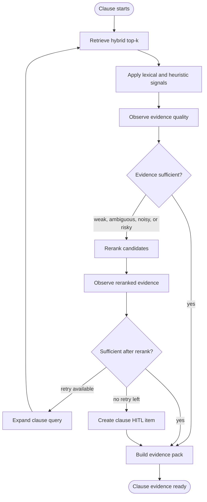

# OfferGuard UAE Offer Review Build Plan

## Project overview

OfferGuard is an AI-assisted UAE offer-letter review system. A user uploads an
offer letter, the system extracts and chunks the document, compares document
evidence against a curated UAE employment rule base, and generates a
fixed-clause report with citations, scores, risk categories, and human-review
checkpoints.

The system should not be described as agentic just because it uses an LLM. Most
of OfferGuard is a normal workflow. The agentic part is the **Evidence Retrieval
Agent**, which loops per clause until it has enough evidence to score the clause
or safely escalates to human review.

Important constraint: this product provides AI-assisted review support, not
legal advice. Every report must include a clear informational-use disclaimer and
evidence citations.

## Architecture principle

Stable workflow:

```text
upload -> store -> extract -> chunk -> embed -> clause review -> report
```

Agentic clause loop:

```text
retrieve -> observe -> decide -> act -> repeat or stop
```

The Evidence Retrieval Agent has one goal:

```text
For the current clause, find enough trustworthy offer evidence and UAE rule
evidence to support a grounded score, or escalate to HITL.
```

The report generator is a structured generation step, not the main agent. It
should only write findings from curated evidence packs.

## Project acceptance criteria

The project is complete when all of the following are true:

- [ ] Users can upload text, Markdown, and supported text-based PDF offer
  letters from the React UI.
- [ ] FastAPI stores original documents in MinIO and workflow/job state in
  PostgreSQL.
- [ ] A worker picks up review jobs asynchronously and runs the LangGraph
  workflow.
- [ ] Extraction normalizes document text, chunks it with sentence-aware
  overlap, and stores chunk metadata.
- [ ] The UAE rules knowledge base is curated, versioned, chunked, embedded, and
  traceable to source, retrieval date, review date, and jurisdiction scope.
- [ ] The Evidence Retrieval Agent uses an observe, decide, act, loop pattern
  for each fixed clause.
- [ ] The default retrieval path avoids LLM-per-chunk classification.
- [ ] First-pass retrieval uses Weaviate hybrid top-k search plus lexical and
  heuristic signals.
- [ ] A reranker is used only when evidence is weak, ambiguous, missing, noisy,
  or potentially risky.
- [ ] Query expansion retries retrieval at most once per clause.
- [ ] HITL checkpoints pause and resume the same workflow when confidence is
  low, evidence is insufficient, or risk is high.
- [ ] Report generation returns structured findings for the fixed clause
  taxonomy with citations.
- [ ] Clause outputs include `status`, `score`, `confidence`, `finding`,
  `offer_evidence`, `rule_evidence`, and `review_required`.
- [ ] Output guardrails enforce JSON schema, citations, and disclaimer
  requirements.
- [ ] Retrieval, reranking, generation, scoring, and HITL outcomes are traced.
- [ ] Offline evals measure retrieval recall, reranker improvement,
  faithfulness, schema validity, scoring quality, and HITL routing quality.

## Evidence Retrieval Agent design

The Evidence Retrieval Agent should be implemented as a bounded LangGraph loop
with explicit state, named nodes, and conditional edges.



### Observe

The agent observes whether retrieved evidence is useful:

- Are there enough offer chunks for the clause?
- Do chunks contain clause-specific terms, amounts, dates, durations, or
  obligations?
- Is the evidence contradictory, ambiguous, or low quality?
- Is a required clause missing from the offer?
- Are matching UAE rule chunks relevant to the same legal topic?
- Are citations available and traceable to original chunks?

### Decide

The agent decides the next action using deterministic thresholds and structured
state:

- If evidence confidence is high, build the evidence pack.
- If evidence is weak but candidates exist, run the reranker.
- If reranked evidence is still weak and retries remain, expand the query and
  retrieve again.
- If evidence remains missing or ambiguous after retries, create a HITL item.
- If extraction quality is low, pause for human review before report generation.

### Act

Allowed actions:

- `retrieve_hybrid_top_k`: search offer chunks and rule chunks.
- `apply_lexical_signals`: score clause-specific keywords and facts.
- `rerank_candidates`: rerank only when first-pass evidence is insufficient.
- `expand_clause_query`: add synonyms and clause-specific legal terms.
- `summarize_evidence`: compress only when context exceeds the model budget.
- `request_human_review`: pause workflow with evidence, reason, and suggested
  reviewer action.

### Loop limits

- Maximum retrieval attempts per clause: 2.
- Maximum reranker calls per clause: 1.
- Maximum evidence chunks sent to generation: configurable by token budget.
- HITL is required when attempts are exhausted without sufficient evidence.

## Workflow state

The graph state should make decisions auditable and resumable:

- `job_id`: review job identifier.
- `document_id`: uploaded document identifier.
- `rule_version`: UAE rule-base version used for the run.
- `clauses`: fixed clause taxonomy for the review.
- `current_clause`: clause currently being evaluated.
- `offer_chunks`: extracted offer chunk ids and metadata.
- `rule_chunks`: matching UAE rule chunk ids and metadata.
- `retrieval_attempts`: per-clause attempt count.
- `candidate_evidence`: retrieved chunks before reranking.
- `reranked_evidence`: optional reranked chunks.
- `lexical_signals`: clause-specific term and fact matches.
- `evidence_confidence`: confidence that evidence is sufficient.
- `clause_findings`: generated structured findings by clause.
- `hitl_items`: clause-level or report-level human review requests.
- `trace_context`: trace ids, tags, and relevant metadata.

## Fixed clause taxonomy

Initial clauses:

- Probation period.
- Notice period.
- Salary and compensation.
- Working hours.
- Annual leave.
- Sick leave.
- Termination.
- End-of-service or gratuity.
- Non-compete or restrictive covenants.
- Confidentiality.
- Governing law and jurisdiction.
- Visa, sponsorship, and employment eligibility.
- Missing or unclear mandatory terms.

Each clause result should use this schema:

```json
{
  "clause_id": "probation_period",
  "status": "good | risk | neutral | missing | needs_human_review",
  "score": 0.0,
  "confidence": 0.0,
  "finding": "Short grounded finding.",
  "offer_evidence": ["offer_chunk_id"],
  "rule_evidence": ["rule_chunk_id"],
  "review_required": false
}
```

## Phase 0 - Project context and working style

Goal:

Keep the project understandable as it grows.

Acceptance criteria:

- [ ] Maintain `PROJECT_CONTEXT.md` as the source of working agreements.
- [ ] Build flow by flow and file by file.
- [ ] Do not bulk-generate large parts of the app without reviewing them.
- [ ] Prefer small vertical slices with tests and explanation.
- [ ] Keep learning value explicit in docs, code organization, and commits.

## Phase 1 - Backend foundation

Goal:

Create the smallest reliable backend foundation before adding product logic.

Acceptance criteria:

- [ ] FastAPI app starts locally.
- [ ] Versioned API routing is present under `/api/v1`.
- [ ] Health endpoints verify app readiness.
- [ ] Settings load from environment variables.
- [ ] Structured logging is enabled.
- [ ] Unit and integration test skeletons run.
- [ ] Docker Compose starts backend, frontend, PostgreSQL, Weaviate, and MinIO.

Suggested build order:

1. Settings and environment model.
2. FastAPI app factory and router.
3. Health routes.
4. Logging setup.
5. Tests for config and health.
6. Compose verification.

## Phase 2 - Upload intake without agent logic

Goal:

Accept an offer document and create durable records for later processing.

Acceptance criteria:

- [ ] `POST /api/v1/documents` accepts text, Markdown, and supported PDFs.
- [ ] File type and size are validated.
- [ ] Original file bytes are stored in MinIO.
- [ ] PostgreSQL records document metadata, checksum, media type, object key,
  upload status, and timestamps.
- [ ] A review job is created with status `queued`.
- [ ] API returns `document_id` and `job_id`.
- [ ] Frontend can upload a file and display the queued job.

Suggested build order:

1. Database models for document and review job.
2. Storage adapter for MinIO.
3. Upload service.
4. API route and response schema.
5. UI upload flow.
6. Unit and integration tests.

## Phase 3 - Extraction, guardrails, and chunking

Goal:

Turn uploaded documents into trustworthy, traceable chunks.

Acceptance criteria:

- [ ] Text extraction supports plain text, Markdown, and text-based PDFs.
- [ ] Input guardrails check file type, size, extraction quality, and
  prompt-injection signals.
- [ ] Chunking uses sentence-aware splitting with budget and overlap.
- [ ] Chunk metadata includes document id, page number when available, section
  heading when available, chunk ordinal, checksum, language, and extraction
  quality.
- [ ] Extracted chunks are persisted in PostgreSQL and indexed in Weaviate.
- [ ] Suspicious text is isolated and flagged rather than silently deleted.

Suggested build order:

1. Extraction interface and plain-text extractor.
2. Markdown extractor.
3. PDF extractor.
4. Input guardrail checks.
5. Chunking utility.
6. Chunk persistence.
7. Weaviate indexing adapter.
8. Tests with sample documents.

## Phase 4 - Curated UAE rule knowledge base

Goal:

Create the static rule base used for grounded comparison.

Acceptance criteria:

- [ ] Rule source files capture source citation, retrieval date, legal review
  date, jurisdiction scope, effective date, and limitations.
- [ ] Rules are organized by fixed clause taxonomy.
- [ ] Rule chunks are indexed in Weaviate with stable ids and metadata.
- [ ] Rule embeddings are rebuildable from source files.
- [ ] Generated text is never treated as an authoritative rule source.

Suggested build order:

1. Rule source file format.
2. Initial rule records for one or two clauses.
3. Rule loader and validator.
4. Rule chunker.
5. Rule embedding script.
6. Retrieval smoke test.

## Phase 5 - First-pass clause retrieval

Goal:

Retrieve candidate evidence for each clause without agentic retries yet.

Acceptance criteria:

- [ ] Fixed clause definitions include retrieval questions and expected evidence.
- [ ] Hybrid top-k search retrieves offer chunks for a clause.
- [ ] Hybrid top-k search retrieves UAE rule chunks for the same clause.
- [ ] Lexical and heuristic signals are computed for clause-specific terms.
- [ ] Evidence confidence is calculated separately from clause risk score.
- [ ] Retrieval traces include query, candidates, scores, and metadata.

Suggested build order:

1. Clause taxonomy module.
2. Retrieval query builder.
3. Offer chunk retrieval.
4. Rule chunk retrieval.
5. Lexical signal calculator.
6. Evidence confidence function.
7. Retrieval tests and small eval fixture.

## Phase 6 - Evidence Retrieval Agent loop

Goal:

Add the real agentic behavior: observe, decide, act, and stop.

Acceptance criteria:

- [ ] LangGraph state tracks current clause, attempts, candidates, confidence,
  and HITL items.
- [ ] The graph observes evidence quality after retrieval.
- [ ] Conditional edges route to evidence pack, reranker, query expansion, or
  HITL.
- [ ] Reranker is called only for weak, ambiguous, missing, noisy, or risky
  evidence.
- [ ] Query expansion retries retrieval at most once.
- [ ] The loop stops after bounded retries.
- [ ] HITL item is created when evidence remains insufficient.
- [ ] Traces show retrieve, observe, rerank, expand, and HITL routing as
  distinct spans.

Suggested build order:

1. Agent state schema.
2. Observe node.
3. Decide routing thresholds.
4. Reranker adapter.
5. Query expansion node.
6. HITL item creation.
7. LangGraph assembly.
8. Agent loop tests with controlled fixtures.

## Phase 7 - Clause finding generation

Goal:

Generate grounded clause findings from curated evidence packs.

Acceptance criteria:

- [ ] Generation receives only selected offer evidence and rule evidence.
- [ ] Structured output is enforced with a Pydantic schema.
- [ ] Each clause output includes status, score, confidence, finding, evidence
  ids, and review flag.
- [ ] Output guardrails reject missing citations, invalid schema, unsupported
  legal claims, and missing disclaimer.
- [ ] Findings distinguish accepted terms, risky terms, unclear terms, and
  missing terms.

Suggested build order:

1. Clause finding schema.
2. Evidence pack schema.
3. Prompt template for one clause.
4. Structured generation adapter.
5. Output guardrail validator.
6. Tests for schema and citation failures.

## Phase 8 - Report assembly and user review UI

Goal:

Turn clause findings into a usable report.

Acceptance criteria:

- [ ] Final report aggregates all clause results.
- [ ] Report includes informational-use disclaimer.
- [ ] UI displays status, score, confidence, finding, and citations per clause.
- [ ] UI clearly shows `needs_human_review` items.
- [ ] Report state is stored in PostgreSQL.
- [ ] Users can revisit completed reports.

Suggested build order:

1. Report schema.
2. Report persistence.
3. Report API routes.
4. Frontend report list.
5. Frontend report detail.
6. Citation display.

## Phase 9 - HITL workflow

Goal:

Make human review an auditable workflow state, not a manual workaround.

Acceptance criteria:

- [ ] Low confidence, high risk, weak extraction quality, missing evidence, and
  guardrail failures can create HITL items.
- [ ] Reviewers can see clause, retrieved evidence, rule evidence, escalation
  reason, and suggested action.
- [ ] Human decisions are stored with reviewer id, timestamp, decision, and
  notes.
- [ ] Workflow resumes from saved checkpoint after human review.
- [ ] Human decisions can be exported into evaluation datasets.

Suggested build order:

1. HITL database model.
2. HITL API routes.
3. HITL queue UI.
4. Decision recording.
5. Workflow resume hook.
6. Export to eval format.

## Phase 10 - Evaluation harness

Goal:

Measure whether retrieval, reranking, generation, scoring, and HITL routing are
working.

Acceptance criteria:

- [ ] Retrieval evals measure expected clause evidence in top-k results.
- [ ] Reranker evals measure whether ordering improves for hard cases.
- [ ] Generation evals check schema validity, citation grounding, and
  faithfulness to evidence.
- [ ] Scoring evals compare known offer examples to expected risk categories.
- [ ] HITL evals check whether ambiguous or risky examples route to review.
- [ ] Baseline eval results are documented before production hardening.

Suggested build order:

1. Eval fixture format.
2. Retrieval eval runner.
3. Reranker eval runner.
4. Generation validation checks.
5. Scoring checks.
6. HITL routing checks.
7. Baseline report.

## Phase 11 - Production hardening

Goal:

Make the workflow reliable, bounded, observable, and safe to operate.

Acceptance criteria:

- [ ] Worker retries handle transient model, Weaviate, PostgreSQL, and MinIO
  failures.
- [ ] Queue processing is idempotent for repeated job pickup.
- [ ] Workflow checkpoints allow safe resume after failure or HITL pause.
- [ ] Rate limits protect upload and review endpoints.
- [ ] Sensitive document content is redacted or sampled before external
  observability export.
- [ ] CI runs linting, type checks, unit tests, integration tests, and eval
  smoke tests.

Suggested build order:

1. Worker retry policy.
2. Idempotency keys and job locking.
3. Checkpoint resume tests.
4. Rate limiting.
5. Observability redaction.
6. CI hardening.
7. Deployment documentation.

## Implementation notes

- Do not classify every chunk with an LLM by default.
- Use retrieval, lexical signals, and reranking as the default evidence path.
- Use LLM judgment for generation and hard-case reasoning only after evidence
  has been selected.
- Keep rule-base source files authoritative and embeddings replaceable.
- Keep retrieval confidence, reranker confidence, clause risk score, and final
  category separate.
- Use HITL when evidence is insufficient, not as a last-minute UI-only approval.
- Store every important state transition so the workflow can be replayed,
  audited, and evaluated.
